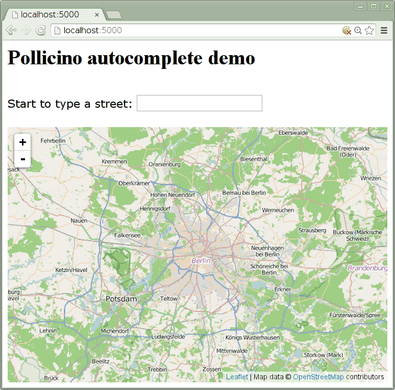

# Pollicino

## Street search, spiced up with multiple storage and geocoders

## Find Pollicino by following breadcrumbs in the woods!

* Free software: LGPL3 license

**Description**

The aim of this project is to be able to execute search in a populated storage
(Elasticsearch, redis, etc) and to use multiple geocoding backends
(OpenStreetMap, Google maps and so on) as a fallback if the address is not
present.
The current (and only) storage used is Elasticsearch, there might be different
storage support in the future. For instance, redis.

## Example interface for the API



## Do-not-use (yet ;)) (really)

```python
from pollicino import config

from pollicino.geocoder import GeocoderClient

geocoder = GeocoderClient.from_config(config.CONFIG)

result = geocoder.geocode('Via Recoaro 1, Broni')
print result

# Formatted for your convenience

{'city': u'Broni',
 'coordinates': [9.2732744, 45.0688205],
 'country': u'Italy',
 'country_code': u'IT',
 'county': u'Lombardia',
 'full_address': u'Via dei Recoaro, 1, 27043 Broni PV, Italy',
 'house_number': u'1',
 'neighbourhood': None,
 'postcode': u'27043',
 'road': u'Via dei Recoaro',
 'state': u'Lombardia',
 'suburb': u'Pavia'}
```

## System requirements to be installed

* Download Elasticsearch 2.3.x

* Install the ICU Analisys plugin for Elasticsearch

    sudo /usr/share/elasticsearch/bin/plugin install analysis-icu

  on debian systems

* Restart Elasticsearch

**NOTE**
on Debian based distributions the `plugin` command is located in:

`/usr/share/elasticsearch/bin/plugin`

* Install Python modules
```
python setup.py develop
```

## Warming up the Elasticsearch storage from an OpenStreetMap data excerpt

Execute: `./scripts/import_addresses.py`
You should have in the `pollicino` index an excerpt of the streets of
**Berlin**.
Try to search for `Landsberg`, it should match `Landsberg*` from Elasticsearch,
otherwise fallback to Google Maps

**NOTE**
Per **Google Maps Terms of Use**, the data can be cached for 30 days maximum, this
will be handled at some point in `pollicino`

## Demo example api plus autocomplete frontend

You can find a bare bone "web interface" in [examples](examples)

To play with the demo, launch the development server:

`python examples/api.py`

And point your browser to http://localhost:5000
